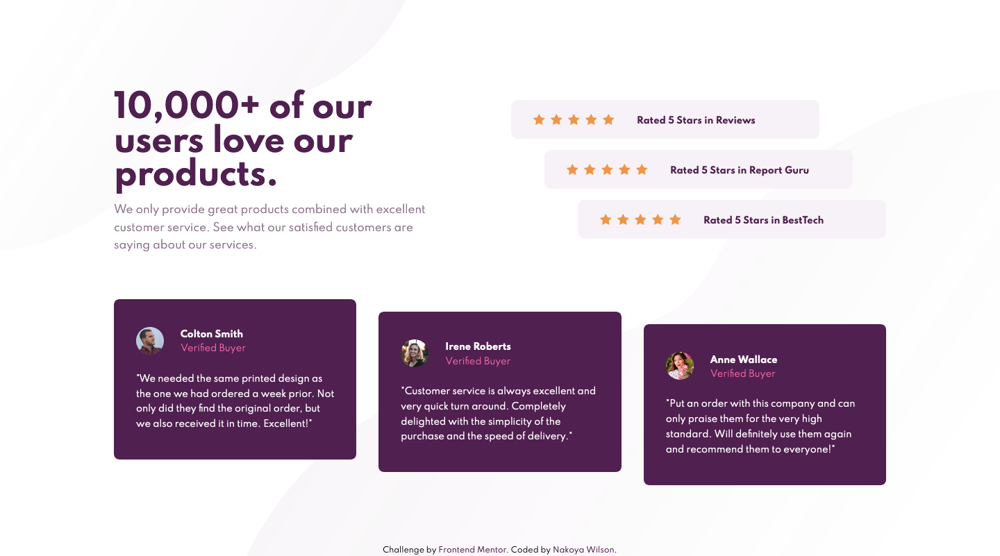

# Frontend Mentor - Social proof section solution

This is a solution to the [Social proof section challenge on Frontend Mentor](https://www.frontendmentor.io/challenges/social-proof-section-6e0qTv_bA). Frontend Mentor challenges help you improve your coding skills by building realistic projects. 

## Table of contents

- [Overview](#overview)
  - [The challenge](#the-challenge)
  - [Screenshot](#screenshot)
  - [Links](#links)
- [My process](#my-process)
  - [Built with](#built-with)
  - [What I learned](#what-i-learned)
  - [Useful resources](#useful-resources)
- [Author](#author)


## Overview

### The challenge

Users should be able to:

- View the optimal layout for the section depending on their device's screen size

### Screenshot



### Links

- Solution URL: [https://www.frontendmentor.io/solutions/social-proof-section-using-flexbox-if1KNgi4j](https://www.frontendmentor.io/solutions/social-proof-section-using-flexbox-if1KNgi4j)
- Live Site URL: [https://nakoyawilson.github.io/social-proof-section/](https://nakoyawilson.github.io/social-proof-section/)

## My process

### Built with

- Semantic HTML5 markup
- CSS custom properties
- Flexbox

### What I learned

During this project I learned that CSS allows you to add multiple background images for an element. 

```css
.example {
  background-image: url(first_url), url(second_url);
  background-position: right bottom, left top;
  background-repeat: no-repeat, repeat;
}
```

### Useful resources

- [CSS Multiple Backgrounds](https://www.w3schools.com/css/css3_backgrounds.asp) - This helped me with using multiple background images.

## Author

- Website - [Nakoya Wilson](https://nakoyawilson.netlify.app/)
- Frontend Mentor - [@nakoyawilson](https://www.frontendmentor.io/profile/nakoyawilson)
- Twitter - [@nakoyawilson](https://twitter.com/nakoyawilson)
- LinkedIn - [@nakoyawilson](https://www.linkedin.com/in/nakoyawilson/)
